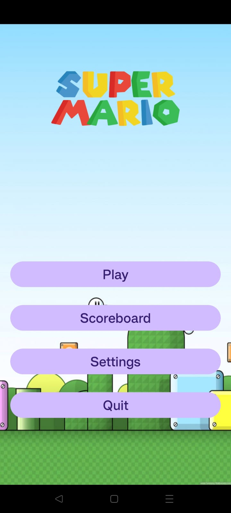
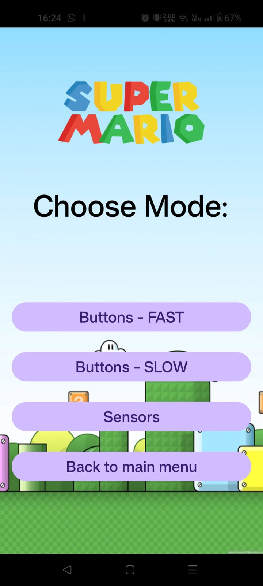
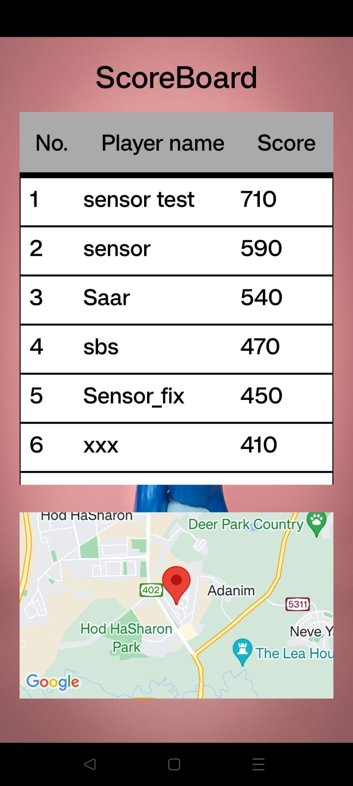
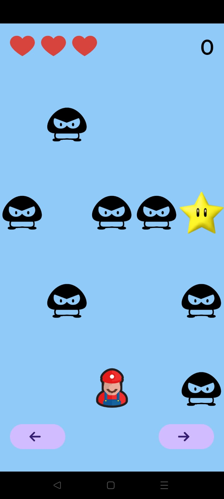
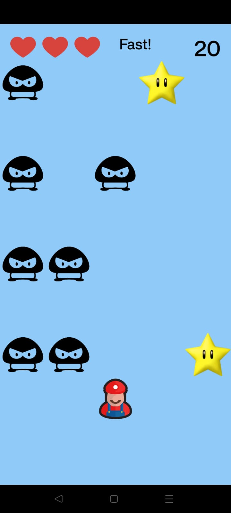
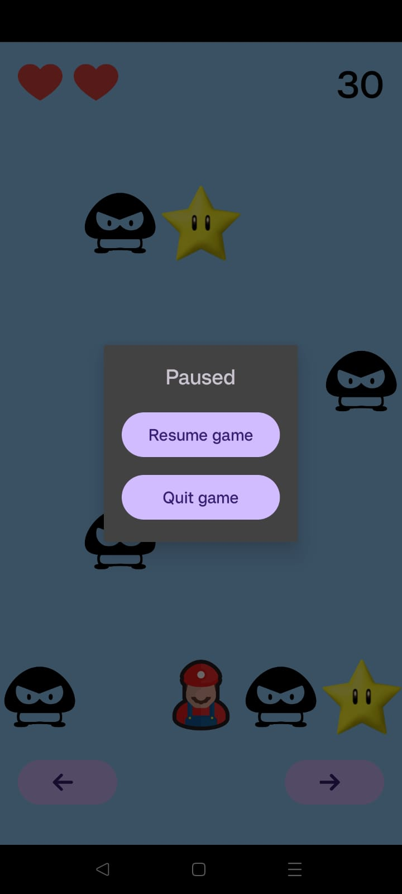
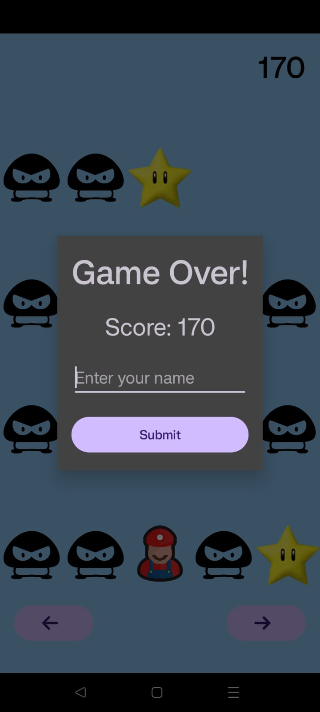

# Exercise No. 2 - Super Mario 2

## Specifics:
**1.** Adjustable number of rows (4-8) and columns (3-5) - default is 8 rows and 5 columns.
**2.** Adjustable game speed (1-5).
**3.** Obstacles come at a constant speed on the road (obstacles come towards the player).
**4.** Crash notification - toast message + vibration + sound.
**5.** 3 Lives.
**6.** App icon design.
**7.** 3 Game mods: buttons-fast, buttons-slow, sensors.
**8.** Sensor mode contains the ability to tilt right/left to move the player.
**9.** Sensor mode contains the ability to tilt up/down to change game speed.

## New implementations:
* Using ***Fragments*** - one fragment to the players records and one for a map: a click on specific record will show the player's location on the map
* Using ***SharedPreferences*** - the player's records are stored on the device's SharedPreferences
* Using ***Google maps API*** - fetching google maps
* Using ***Device's location services*** - for setting the longitude and altitude of the players current location
* Using ***MediaPlayer*** - Used for crash sound ('Ouch')
* Using ***Adapter & RecyclerView*** - to the Top Ten highscores: designed one object and than by the RecyclerView creates 10 duplications of it

## Game Flow:
- **OnPause:** Freezes when exiting the app.
- **OnResume:** Continues from where it paused when returning to the app.
- **Timer:** Scheduled appearance of obstacles.
- **Vibrator & Toast:** Used for every crash.

## Menus screenshots:

| Main Menu | Settings | Game modes | ScoreBoard |
| --- | --- | --- | --- |
|  |  |  |  |

## In-Game screenshots:

| Buttons Mode | Sensor Mode | Pause Dialog | Game Over Dialog |
| --- | --- | --- |
|  |  |  |  |

## Buttons game Preview:
https://github.com/SaarGamzo/SuperMario-EX1/assets/88244818/9d6843d0-1cc6-452c-919a-dc1954cfe2c1

## Sensog game Preview:
https://github.com/SaarGamzo/SuperMario-EX1/assets/88244818/9d6843d0-1cc6-452c-919a-dc1954cfe2c1