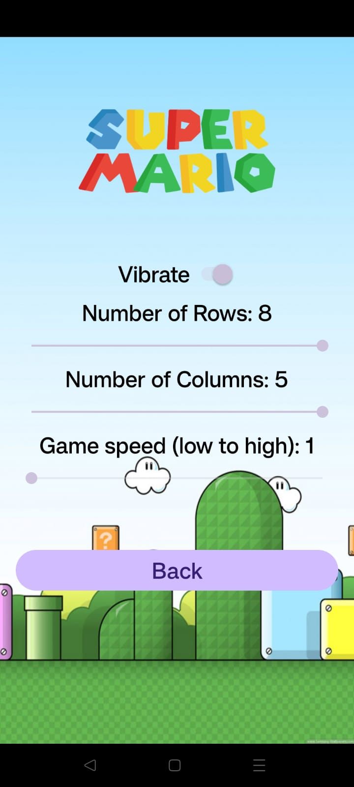

# Exercise No. 2

## Specifics:
1. Adjustable number of rows (4-8) and columns (3-5).
2. Adjustable game speed (1-5).
3. Player that can move left and right.
4. Obstacles on the road.
5. Obstacles come at a constant speed on the road (obstacles come towards the player).
6. Crash notification - toast message + vibration.
7. 3 lives.

## Game Flow:
- **OnPause:** Freezes when exiting the app.
- **OnResume:** Continues from where it paused when returning to the app.
- **Timer:** Scheduled appearance of obstacles.
- **Vibrator & Toast:** Used for every crash.

## Screenshots:

| Main Menu | Settings | In-Game |
| --- | --- | --- |
|  |  |  |

## Video Preview:

https://github.com/SaarGamzo/SuperMario-EX1/assets/88244818/9d6843d0-1cc6-452c-919a-dc1954cfe2c1
